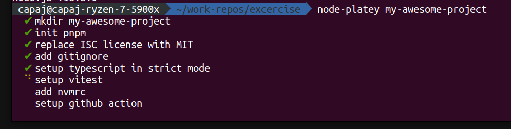

# node-platey

a simple opinionated node.js CLI utility to setup a new node.js library project including typescript, vitest, prettier and basic github action for checking each commit to `main`.

What this does

- create the directory
- git init
- adds `.gitignore` same as github does when you init node.js project
- `pnpm init`
- replace `ISC` with `MIT`
- setup typescript in strict mode
- setup vitest
- add `.nvmrc` based on the latest node.js version
- setup github action with typescript check and test run
- setup prettier with githooks using husky(TODO)

No version is hardcoded, so you should be getting the latest stuff every time you run `node-platey` command.

## Prerequisites

`pnpm`
